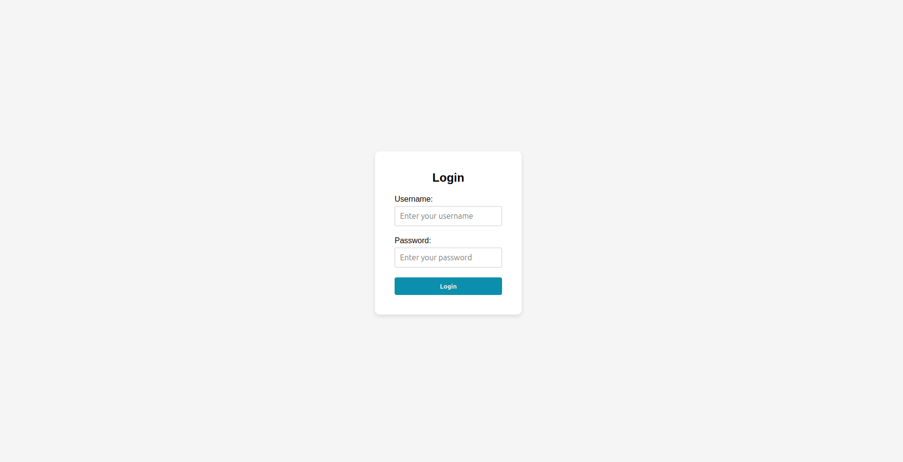
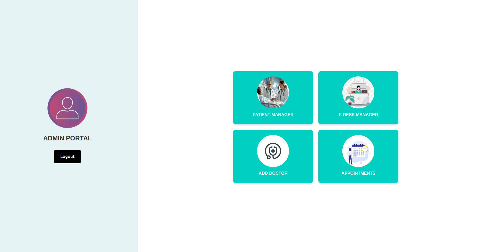
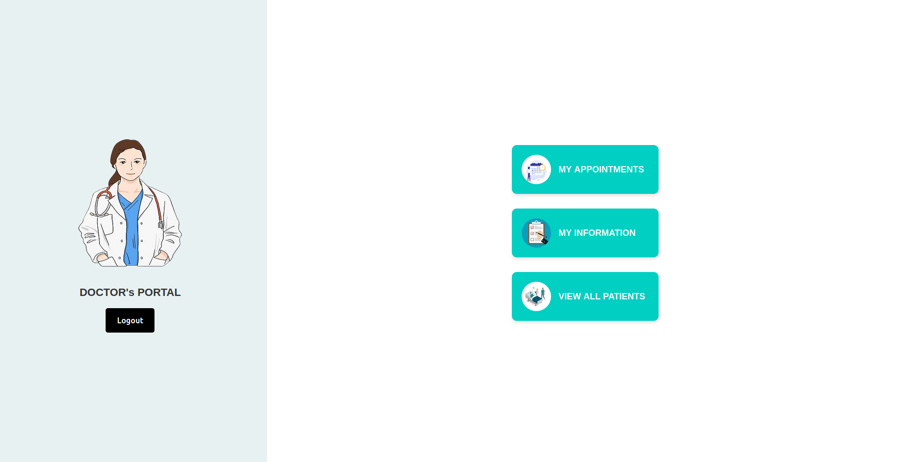

# Hospital Management System

A comprehensive web-based Hospital Management System built using PHP and MySQL. This project streamlines the daily operations of hospitals, including managing doctors, patients, and appointments.

## Features

- User Authentication (Admin & Doctor)
- Doctor Management
- Patient Management
- Appointment Scheduling
- Responsive Web Design
- Dark & Light Mode

## Tech Stack

- **Frontend:** HTML5, CSS3, JavaScript  
- **Backend:** PHP  
- **Database:** MySQL
- **operating System:** Linux

##  Screenshots

### Font Portal


### Dark Mode


### Login Page


### Admin Portal


### Doctor Portal


<!-- ### Appointments
 -->

<!-- ### Delete Doctor
 -->

### Front Dask Portal


## Installation

1. Clone the repository:
   ```bash
   git clone https://github.com/codewithdhruba01/Hospital-Management-System.git
   ```

2. Set up a local server (e.g., [XAMPP](https://www.apachefriends.org/index.html)) and place the project folder inside the `htdocs` directory.

3. Create a MySQL database named `hospital_management` and import the SQL file provided.

4. Start Apache and MySQL from XAMPP and open your browser:
   ```
   http://localhost/Hospital-Management-System/
   ```

## Login Credentials

- **Admin**
  - Username: `admin`
  - Password: `admin123`

- **Doctor**
  - Username: `doctor`
  - Password: `doctor123`

### 👥 Contributors

- [@codewithdhruba01](https://github.com/codewithdhruba01)
- [@AkashAdak-coder ](https://github.com/AkashAdak-coder)  
- [@Reyaz556](https://github.com/Reyaz556)

## License

This project is licensed under the [MIT License](LICENSE).
